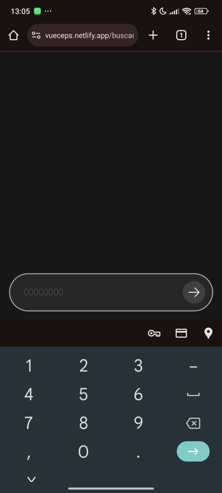

# VueMaps - TradeUp - Avaliação Técnica
Teste de habilidades em back e frontend com integração na ViaCEP API.

## aplicação:
[vueceps.netlify.app](https://vueceps.netlify.app)

## Requisitos do teste:

- Desenvolva uma SPA em VUE
- Uma página de home para o minissistema (com uma descrição, uma imagem, um botão que abre outra página com vueRouter)
- Na nova página:
    - Um campo de pesquisa numérico (CEP) que aceite somente números, somente no formato de um cep.
    - Retornar o endereço do cep pesquisado, amigávelmente
    - Um botão voltar, que volta para a página de home (utilizar o router).

## Visão geral
Tanto o front quanto o backend estão "dockeirizado". O backend numa stack LAMP (Linux, Apache, MariaDB e PHP) com Node para gerenciamento de pacotes JS (mas não foi necessário nesse projeto) e Laravel.

O frontend com basicamente Node e NPM.

## Principais Tecnologias
- Backend
    - Laravel
- Frontend
    - Vue
    - VueRouter
    - Tailwind
    - Axios
    - Vue Toastification

## Setup

Caso você tenha docker e docker compose instalados, o setup desse projeto será algo ridiculamente simples:

- Backend
    - Acessar a pasta ```backend``` e rodar ```sh setup.sh```
- Frontend
    - Acessar a pasta ```frontend``` e rodar ```sh setup.sh```

Para não usuários de docker, eu imagino que as seguintes etapas devem ser feitas manualmente:

- Backend (dentro da pasta ```backend/app```)
    - Criar o arquivo ```.env``` copiando e renomeando o arquivo```.env.example```
    - Rodar ```composer install```
    - Rodar ```php artisan key:generate```
    - Rodar ```php artisan serve```
- Frontend (dentro da pasta ```frontend/app```)
    - Rodar ```npm i```
    - Rodar ```npm run dev```

O script ```setup.sh``` faz isso tudo por conta própria, mas é necessário ter o Docker instalado. Caso esse setup seja feito manualmente, será necessário ir vendo os erros de ambiente que acontecem e ir corrigindo, uma vez que apenas você sabe o que tem instalado na sua máquina e quais portas e quais hosts estão parametrizados.

## Setup pronto com Docker
Como mencionado anteriormente, o que é necessário para fazer o setup com Docker, é rodar o comando ```sh setup.sh``` tanto no front quanto no backend.

> Para parar o funcionamento do container (front e backend), o comando ```sh down.sh``` pode ser chamado.

Após rodar o comando ```sh setup.sh```, os seguintes serviços estarão disponíveis:

- Backend (```Aplicação Laravel```)
    - Endpoint da busca de CEP: ```http://localhost/api/cep?cep=...```
- Frontend (```Aplicação VueJS```)
    - Index: ```http://localhost:3000```

Se tudo ocorreu bem e você acessou ```http://localhost:3000```, essa tela deve estar sendo exibida:


## Netlify
Tomei a liberdade de hospedar esse SPA no [netlify](https://vueceps.netlify.app), fazendo a requisição diretamente na api do [viacep](https://viacep.com.br).

## Frontend - Detalhamento técnico

A seguir, vou detalhar o frontend com os pontos que considero que atendem os requisitos do teste proposto como organização, planejamento e visão sistêmica, bem como pontos que considero um "plus".

- Organização
    - Tudo está separado em pastas. views, hooks, assets, styles, services, utils e rotas.
- Visão sistêmica
    - Organizei e separei a lógica do template. Dessa forma o código fica mais limpo e fácil de entender e manter.
    - Criei um service para requisições http com uma URL base de requisições, apontando para o backend laravel (ao invés de usar diretamente a instância do axios).
    - Criei um service para requisições unicamente de cep, para que toda a aplicação possa usar essa chamada simplesmente chamando a função ```getCep(...)```, ao invés de deixa-la engessada no componente e caso fosse necessário fazer isso em outros componentes, eu precisasse copiar e colar código
    - Criei um util de validação de CEP, também imaginando que posso usa-lo por toda a aplicação e não ficar acoplado em um único componente forçando duplicidade de código.
    - Tratamento de erros: O app trata de maneira eficiente os erros que podem acontecer, como resposta de erro da api ou CEP inválido, dando alertas em toasts para o usuário e exibindo uma mensagem de dados não encontrados para o CEP informado.


- Planejamento
    - Antes de escrever a primeira linha de código eu já sabia que deveria organizar dessa maneira o projeto, para que ele já nascesse limpo e componentizado. Também já queria que fosse fácil ver e subir esse projeto, por isso o uso do docker, que pemite que com um comando eu suba todo o ambiente de desenvolvimento. Isso em um contexto de equipe facilita muito o desenvolvimento.


<hr />


- Plus
    - DarkMode: o app responde ao tema do sistema do usuário, tendo o modo dark e modo light.
    - Hospedagem: O app está hospedado no [netlify](https://vueceps.netlify.app), sendo fácil de visualizar. Já está responsivo e atende alguns pontos que deixam a experiência do usuário melhor, como quando ele clica no campo de digitação do CEP, o teclado chamado já é o numérico (isso no mobile). Isso parece "besta" mas cada detalhe faz a diferença na satisfação do usuário final (bem como fonte com leitura fácil e darkmode para uso noturno).




## Backend - Detalhamento técnico

A seguir, vou detalhar o backend com os pontos que considero que atendem os requisitos do teste proposto como organização, planejamento e visão sistêmica.

- Organização
    - Mesmo em cima de um framework como o Laravel, que já nasce organizado, ainda sim é possível fazer coisas ruims e desorganizadas. Sem o estabelecimento de padrões de código e arquitetura, qualquer projeto pode virar facilmente um frankenstein. O backend está organizado em controllers, services e Request validations.

- Visão sistêmica
    - Organizei e separei a lógica do controller, da requisição para a api do viacep. Dessa forma o código fica mais limpo e fácil de entender e manter.
    - Criei um service para requisições no viacep (ao invés de usar diretamente no controller, deixando a lógica acomplada nele). Dessa forma, posso usar essa feature em qualquer parte do sistema e ela tem uma responsabilidade única e clara.
- Planejamento
    - Antes de escrever a primeira linha de código eu já sabia que deveria organizar dessa maneira o projeto, para que ele já nascesse limpo e organizado. Também já queria que fosse fácil subir esse projeto, por isso o uso do docker, que pemite que com um comando eu suba todo o ambiente de desenvolvimento. Isso em um contexto de equipe facilita muito o desenvolvimento.


# Network

<a href="https://www.linkedin.com/in/felipeoli7eira" target="blank">
    
</a>

<a href="https://instagram.com/oli7eirafelipe" target="blank">
    
</a>
